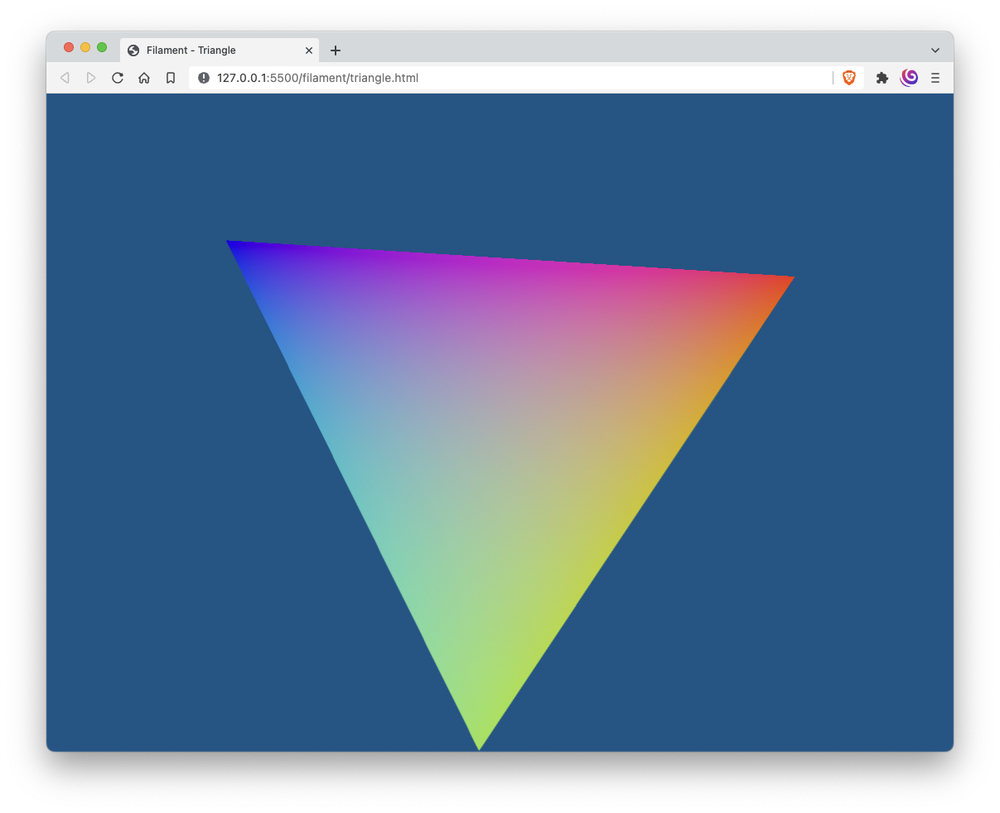
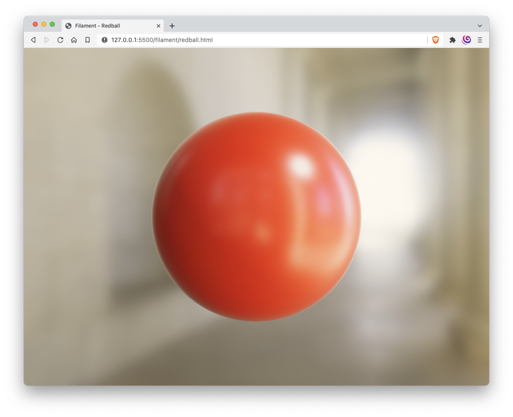
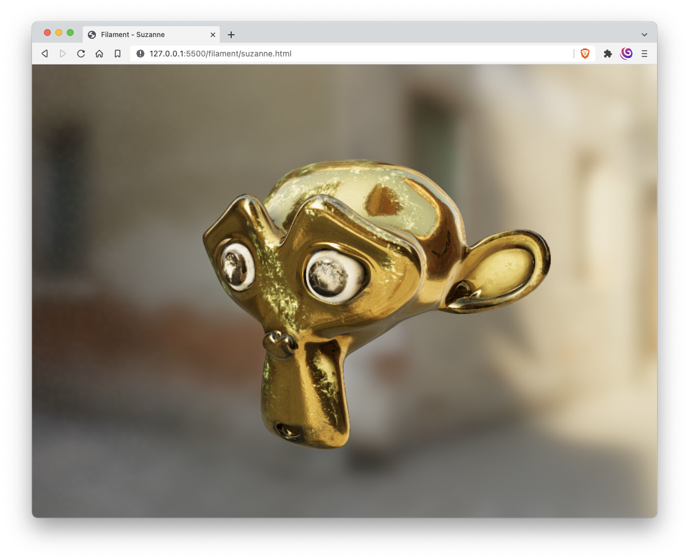

# Filament Web Samples

This repository show the basic setup and use of Filament for the web platform through these tutorials.

**Filament** is a real-time physically based rendering engine for Android, iOS, Windows, Linux, macOS, and WebGL2 (developed and maintened by Google).

Official repo: https://github.com/google/filament

> NOTE: Samples include binaries for macOs. For other platforms, you need to get binaries from https://github.com/google/filament/releases and set custom scripts (same as `make-assets.sh`).

## [Triangle tutorial](https://google.github.io/filament/webgl/tutorial_triangle.html)

## [Redball tutorial](https://google.github.io/filament/webgl/tutorial_redball.html)

## [Suzanne tutorial](https://google.github.io/filament/webgl/tutorial_suzanne.html)

## Dependencies

- [filament (1.21.3)](https://github.com/google/filament) (3d renderer engine)
- [gl-matrix (2.8.1)](https://github.com/toji/gl-matrix) (matrix and vector library)
- [gltumble (1.0.1)](https://github.com/prideout/gltumble) (trackball camera)